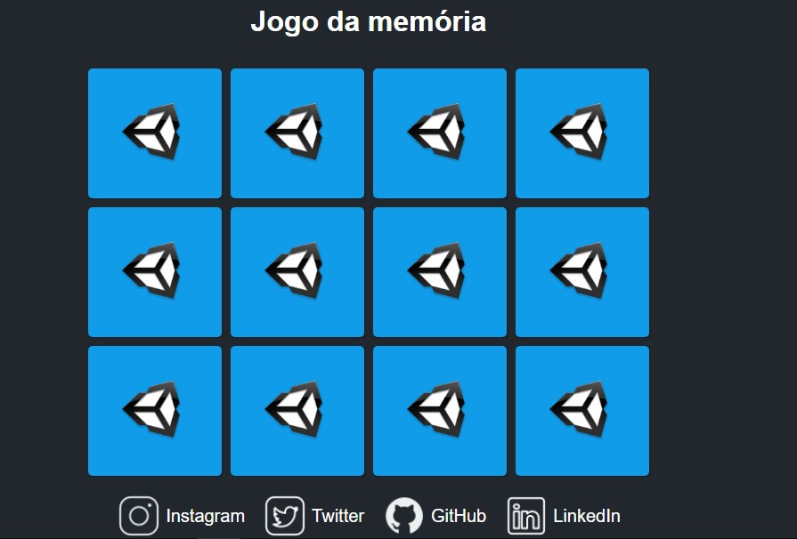

# Jogo-da-memoria
Projeto desenvolvido no evento da  Digital Innovation One Inc. ( DIO )

# DIO 

> Trilha Explorer

Projeto construído no bootcamp da DIO

[🔗 Clique aqui para acessar](https://jrodrygues.github.io/Jogo-da-memoria/)

## 🛠 Tecnologias

- HTML
- CSS
- JavaScript
- Git e Github

## 💛 Contato

📧 jesserodrygues.jr@gmail.com
📱 14 991136982
